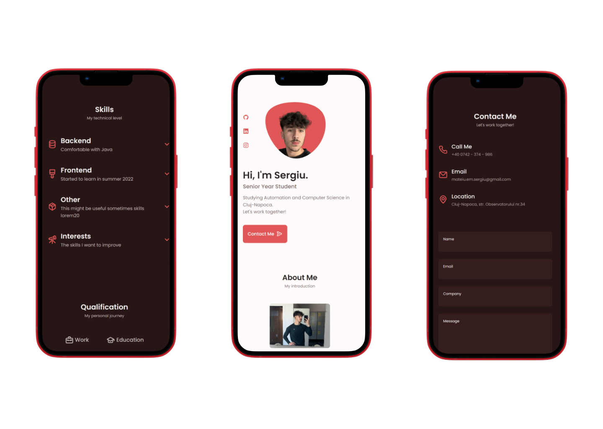

# Responsive Portfolio Website Sergiu
## Responsive Portfolio

- Template: [Bedimcode](https://www.youtube.com/c/Bedimcode)
- Responsive Personal Portfolio Website Using HTML CSS & JavaScript
- Smooth scrolling in each section.
- Includes a light and dark mode.
- Developed first with the Mobile First methodology, then for desktop.
- Compatible with all mobile devices and with a beautiful and pleasant user interface.
- Email Sender via Formspree
- Well structured

