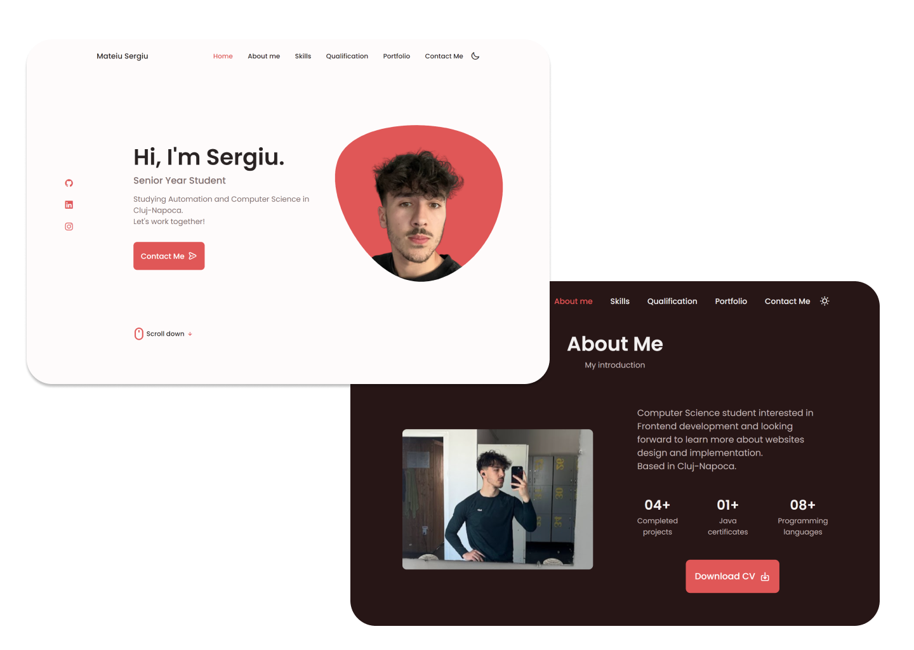

# :open_file_folder: Responsive Portfolio 

[Live Demo.:point_left:](https://serh1.github.io/responsive-portfolio/)

- Followed tutorial and then adding my ideas. [Bedimcode](https://www.youtube.com/c/Bedimcode)
- Responsive Personal Portfolio Website Using HTML CSS & JavaScript
- Compatible with all mobile devices and with a beautiful and pleasant user interface.
- Developed first with the Mobile methodology, then for desktop.
- Smooth scrolling in each section.
- Includes a light and dark mode.
- Email Sender via Formspree
- Well structured

